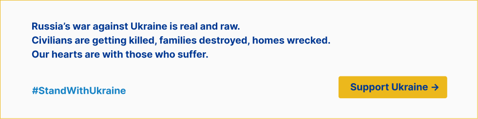
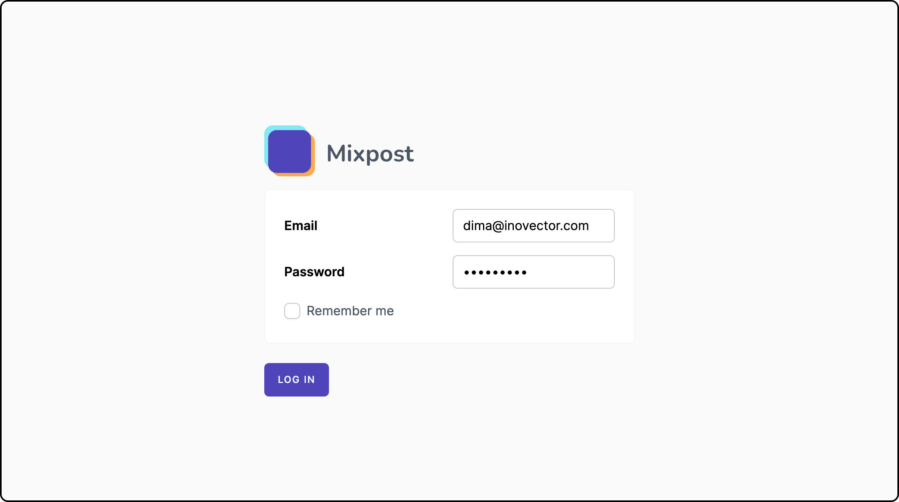

[](https://supportukrainenow.org)

* * *

[](https://mixpost.app)

[](https://packagist.org/packages/inovector/mixpost-auth)
[](https://github.com/inovector/mixpost-auth/actions?query=workflow%3Arun-tests+branch%3Amain)
[](https://packagist.org/packages/inovector/mixpost-auth)

## Introduction

Mixpost Auth provides a login page for the [Mixpost](https://github.com/inovector/mixpost) package. If you already have user management, do not install this package. Install only if you don't have one.

Join our community:

- [Discord](https://discord.gg/5YdseZnK2Z)
- [Facebook Private Group](https://www.facebook.com/groups/inovector)

[](https://mixpost.app)

## Requirements

* Laravel Framework [^9.0, ^10.0]
* PHP 8.1 or higher
* Database (eg: MySQL, PostgresSQL, SQLite)

## Installation

You may use Composer to install Mixpost Auth into your new Laravel project:

```bash
composer require inovector/mixpost-auth
```

After installing the Mixpost Auth package, you may execute:

```bash
php artisan vendor:publish --tag=mixpost-auth-assets
```

You can publish the config file with:

```bash
php artisan vendor:publish --tag=mixpost-auth-config
```

This is the contents of the published config file:

```php
return [
    /*
     * After login will redirect to this url.
     */
    'redirect_to_url' => '/mixpost',

    /*
     * The model you want to use as a User model.
     */
    'model_user' => \Inovector\MixpostAuth\Models\User::class
];
```

## Create a new user

To create a new user, you can run this command: `php artisan mixpost-auth:create` and follow the instructions.

## Change user password

To change user password, you can run this command: `mixpost-auth:password example@mail.com` and follow the instructions.

## Visit

After performing all these steps, you should be able to visit the Login page at /mixpost/login.

## Testing

```bash
composer test
```

## Changelog

Please see [Releases](../../releases) for more information what has changed recently.

## Contributing

By participating in this project you agree to these conditions 👇

Please note that this project is a [commercial product](https://mixpost.app/), and this repository is the lite version
of Mixpost Pro. We work hard to offer the community the best free social media manager solution and please read this
section carefully.

If you want to add a feature, it's better to open an issue before you start coding. It is important for us that features
from the Lite version do not correlate with features from the Mixpost Pro. PRs with optimizations, bug fixes are
welcome.

Please, be very clear on your commit messages and pull requests, empty pull request messages may be rejected.

When contributing code to Mixpost Auth, you must follow
the [PSR-12 Coding Standard](https://github.com/php-fig/fig-standards/blob/master/accepted/PSR-12-extended-coding-style-guide.md).
The golden rule is: Imitate the existing Mixpost Auth code.

## Security Vulnerabilities

Please review [our security policy](../../security/policy) on how to report security vulnerabilities.

## Credits

- [Dima Botezatu](https://github.com/lao9s)
- [All Contributors](../../contributors)

## License

Mixpost Auth is licensed under the [MIT License](LICENSE.md), sponsored and supported by [Inovector](https://inovector.com).
